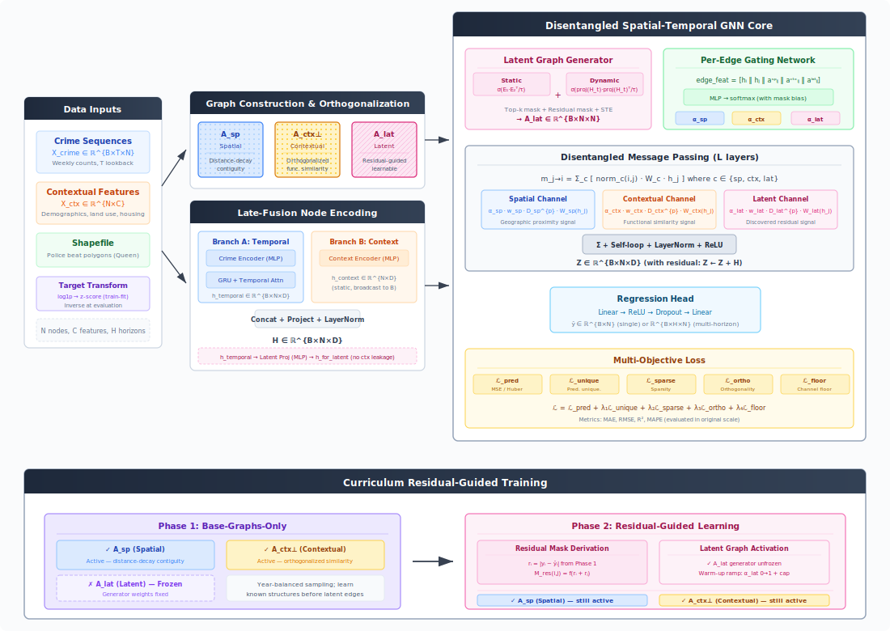

# Interpretable Spatio-Temporal GNN for Crime Prediction

A PyTorch-based framework for spatially and temporally interpretable crime prediction using a **disentangled, multi-graph Graph Neural Network** with two-phase curriculum training.

The model simultaneously learns *when* and *through which relational channel* crime patterns propagate across geographic regions — producing predictions that are both accurate and interpretable.

---

## Architecture Overview



The model is structured around three complementary graph channels and a two-phase curriculum:

**Graph channels**

| Channel | Matrix | Description |
|---|---|---|
| Spatial | A\_sp | Queen / Rook / KNN contiguity with optional distance-decay weighting |
| Contextual | A\_ctx⊥ | Cosine / RBF similarity on socio-economic features, Gram–Schmidt orthogonalised against A\_sp |
| Latent | A\_lat | Learned residual graph — static (E₁·E₂ᵀ) + dynamic (H-driven), guided by Phase-1 prediction errors |

**Forward pipeline (per batch)**

1. **Late-fusion node encoding** — crime history through a Crime MLP → GRU (+ optional temporal attention) produces `h_temporal`; static context through a Context MLP produces `h_context`; both are fused into `H`.
2. **Latent graph generation** — `h_temporal` (not `H`) drives `A_lat` via the `ResidualLatentGraphGenerator`, keeping the latent channel free of contextual-feature information already captured by A\_ctx.
3. **Per-edge gating** — `ScaleAwareGatingNetwork` produces softmax weights α\_sp, α\_ctx, α\_lat per edge, with mask-bias penalising channels with zero adjacency and the latent channel initialised near-zero (must earn its contribution).
4. **Disentangled message passing** — `DisentangledGNN` uses three separate weight matrices (W\_sp, W\_ctx, W\_lat) with per-channel degree normalisation and learnable `deg_power`.
5. **Residual + prediction head** — Z = GNN(H) + H → regression head (or sigmoid for classification).

**Two-phase curriculum training**

- *Phase 1* — base graphs only (A\_lat frozen); trains the spatial+contextual backbone.
- *Phase 2* — latent graph unfrozen with residual-mask guidance (node pairs with high Phase-1 error are prioritised); α\_lat is warmed up linearly over `latent_warmup_epochs` and capped at `alpha_lat_cap`.

---

## Repository Structure

```
crime_gnn/
├── __init__.py
├── config.py                  # All dataclass configs + argparse builder
├── data/
│   ├── __init__.py
│   ├── graph_construction.py  # Spatial & contextual graph construction utilities
│   └── dataset.py             # CrimeDataProcessor, CrimeDataset, prepare_data
├── models/
│   ├── __init__.py
│   ├── components.py          # TemporalEncoder, ResidualLatentGraphGenerator,
│   │                          #   LearnableGraphScaling, ScaleAwareGatingNetwork
│   ├── gnn.py                 # DisentangledConv, DisentangledGNN
│   └── stgnn.py               # InterpretableSTGNN (unified regression+classification)
├── training/
│   ├── __init__.py
│   ├── losses.py              # CrimePredictionLoss (multi-objective)
│   └── trainer.py             # CurriculumTrainer (two-phase curriculum)
└── analysis/
    ├── __init__.py
    ├── attribution.py         # OrthogonalAttributionAnalyzer, DisentanglementReporter,
    │                          #   build_pairwise_edge_table, summarise_edge_table
    └── visualization.py       # plot_training_history, plot_adjacency_comparison,
                               #   plot_edge_alpha_heatmaps
train.py                       # CLI entry point
requirements.txt
```

---

## Installation

```bash
# 1. Install PyTorch (match your CUDA version from https://pytorch.org)
pip install torch torchvision torchaudio

# 2. Install PyTorch Geometric
pip install torch_geometric

# 3. Install remaining dependencies
pip install -r requirements.txt
```

---

## Quick Start

### Regression (crime count prediction)

```bash
python train.py \
  --crime_csv_path  data/crimes.csv \
  --shapefile_path  data/beats.shp \
  --target_col      cnt \
  --output_dir      ./output
```

### Classification (binary crime event prediction)

```bash
python train.py \
  --task_type       classification \
  --label_col       is_violent \
  --crime_csv_path  data/crimes.csv \
  --shapefile_path  data/beats.shp \
  --output_dir      ./output_clf
```

### Multi-horizon regression (predict 1, 2, and 4 weeks ahead)

```bash
python train.py \
  --crime_csv_path data/crimes.csv \
  --shapefile_path data/beats.shp \
  --multi_horizon  1 2 4
```

### Ablation study (full model vs. no latent graph vs. no gating)

```bash
python train.py \
  --crime_csv_path data/crimes.csv \
  --shapefile_path data/beats.shp \
  --run_ablation
```

---

## Input Data Format

### Crime CSV

A weekly-aggregated file with at minimum:

| Column | Type | Description |
|---|---|---|
| `region_col` (e.g. `BEAT`) | str | Region identifier matching the shapefile |
| `year` | int | Year of observation |
| `week` | int | ISO week number |
| `target_col` (e.g. `cnt`) | float | Crime count (regression) or binary label (classification) |
| contextual columns | float | Socio-economic / built-environment features |

### Shapefile

A polygon shapefile for the regions (police beats, census tracts, etc.) with a column matching `--region_col`.

---

## Configuration Reference

All hyperparameters are configurable via CLI flags.  Run `python train.py --help` for the full list.  Key groups:

### Data (`--*`)

| Flag | Default | Description |
|---|---|---|
| `--lookback_weeks` | 4 | Number of historical weeks fed to the temporal encoder |
| `--forecast_horizon` | 1 | Weeks-ahead to predict (overridden by `--multi_horizon`) |
| `--multi_horizon` | None | List of horizons for simultaneous multi-horizon regression |
| `--target_transform` | `log1p+zscore` | Target pre-processing pipeline (regression only) |
| `--task_type` | `regression` | `regression` or `classification` |

### Graph (`--*`)

| Flag | Default | Description |
|---|---|---|
| `--spatial_method` | `queen` | Contiguity method: `queen`, `rook`, `knn` |
| `--use_continuous_spatial` | True | Distance-decay weighting on spatial edges |
| `--contextual_similarity` | `cosine` | `cosine` or `rbf` for A\_ctx |
| `--contextual_threshold` | 0.5 | Minimum similarity to keep a contextual edge |
| `--use_orthogonalization` | True | Gram–Schmidt orthogonalise A\_ctx w.r.t. A\_sp |
| `--latent_topk_per_node` | 5 | Top-k edges per node in A\_lat |

### Model (`--*`)

| Flag | Default | Description |
|---|---|---|
| `--hidden_dim` | 128 | Main hidden dimension |
| `--temporal_encoder` | `GRU` | `GRU`, `LSTM`, or `Transformer` |
| `--num_gnn_layers` | 3 | Number of DisentangledConv layers |
| `--use_temporal_attention` | True | Temporal self-attention on the GRU output |
| `--use_separate_gating_input` | True | Separate projection for the gating network |
| `--gate_hidden_dim` | 32 | Hidden dimension of the gating MLP |

### Training (`--*`)

| Flag | Default | Description |
|---|---|---|
| `--pred_loss` | `huber` | Prediction loss: `huber`, `smooth_l1`, `mse` |
| `--phase1_epochs` | 20 | Phase-1 (base graphs only) epochs |
| `--phase2_epochs` | 130 | Phase-2 (+ latent graph) epochs |
| `--latent_warmup_epochs` | 15 | Epochs to ramp α\_lat from 0 → 1 |
| `--latent_lr_multiplier` | 0.3 | LR scale for latent-graph parameters |
| `--alpha_lat_cap` | 0.40 | Hard cap on α\_lat per edge |
| `--phase2_min_r2` | 0.0 | Minimum val R² required before Phase 2 (regression guard) |
| `--lambda_pred_unique` | 0.1 | Predictive-uniqueness regularisation weight |
| `--lambda_sparse` | 0.05 | Sparsity regularisation weight |
| `--lambda_ortho` | 0.05 | Channel-orthogonality regularisation weight |
| `--lambda_floor` | 0.5 | Floor regularisation weight |
| `--early_stopping_patience` | 30 | Per-phase early-stopping patience |
| `--device` | auto | `cuda` or `cpu` |

### Ablation (`--*`)

| Flag | Description |
|---|---|
| `--disable_latent_graph` | Remove A\_lat entirely (base-graphs-only ablation) |
| `--disable_gating` | Replace learned α with uniform channel weights |

---

## Outputs

Each run creates a subdirectory under `--output_dir`:

```
output/full_model/
├── best_model.pt                   # Best checkpoint
├── checkpoint_e<N>.pt              # Periodic checkpoints
├── disentanglement_report.txt      # Textual graph disentanglement analysis
├── pairwise_edge_attribution.csv   # Per-edge attribution table
├── training_history.png            # Loss, metrics, channel weights
├── adjacency_comparison.png        # A_sp / A_ctx / A_lat heatmaps
└── edge_alpha_heatmaps.png         # Per-edge α_sp / α_ctx / α_lat heatmaps
```

---

## Loss Function

The multi-objective loss combines five components:

```
L = L_pred
  + λ₁ · L_unique    (penalise A_lat redundancy with known graphs)
  + λ₂ · L_sparse    (keep A_lat near target density)
  + λ₃ · L_ortho     (decorrelate per-node channel weights)
  + λ₄ · L_floor     (prevent any channel from dying)
```

**Regression specifics** — `L_pred` is Huber loss; `L_unique` uses a *multiplicative* redundancy term (penalises only true double-coverage by both A\_sp and A\_ctx); `L_floor` applies to spatial + contextual channels only (the latent channel must earn its weight).

**Classification specifics** — `L_pred` is Focal BCE; `L_unique` uses an *additive* overlap term; `L_floor` applies to all three channels.

---

## Interpretability

After training, three complementary analyses are produced automatically:

**Per-node channel weights** — `w_sp`, `w_ctx`, `w_lat` indicate which relational channel dominates each region's predictions.

**Latent edge analysis** — Top-N strongest latent edges are listed with flags indicating whether they overlap with (or are exclusive to) the spatial and contextual graphs, plus a persistence score (fraction of samples where each edge was active).

**Pairwise edge attribution table** — every edge in the union graph is characterised by its dominant source, effective contribution per channel, and categorical type (e.g. `spatial_only`, `persistent_latent`, `all_three`).

---

## Extending the Framework

**New temporal encoder** — add a branch to `TemporalEncoder.__init__` in `crime_gnn/models/components.py` and pass the encoder name via `--temporal_encoder`.

**New graph construction method** — add a function to `crime_gnn/data/graph_construction.py` and call it from `CrimeDataProcessor.compute_contextual_similarity`.

**New task** — add a task branch in `CrimePredictionLoss.forward` (losses.py), `CurriculumTrainer._compute_*_metrics` (trainer.py), `plot_training_history` (visualization.py), and the `task_type` argparse option in `config.py`.

---

## Citation

If you use this code in your research, please cite:

```bibtex
@misc{crime_gnn_2025,
  title  = {Interpretable Spatio-Temporal GNN for Crime Prediction},
  year   = {2025},
  url    = {https://github.com/your-org/crime_gnn}
}
```
